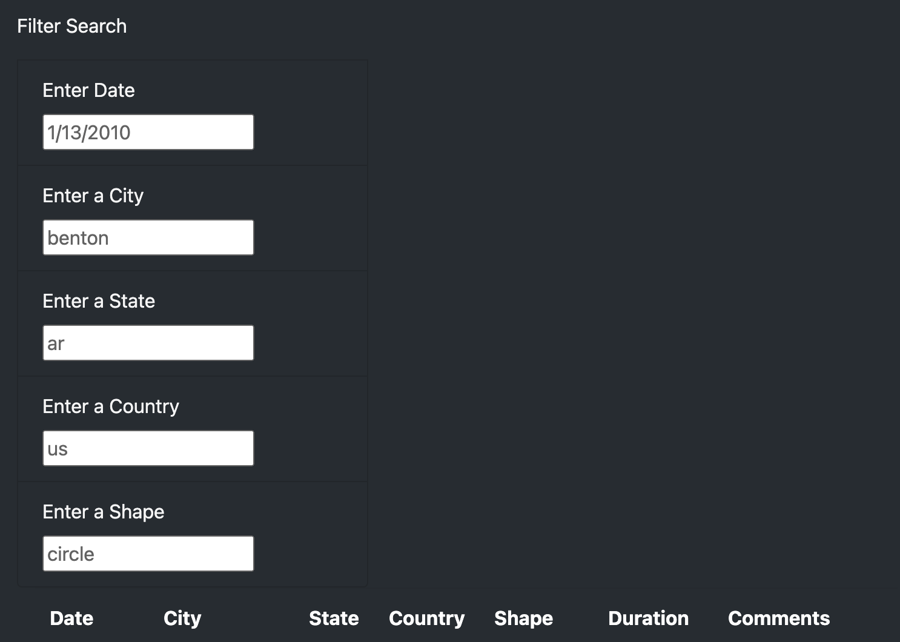

# UFOs

## Table of Contents
- [1.0 Project Overview](#Project-Overview)
  * 1.1 Purpose
  * 1.2 Resources
- [2.0 Results](#Results)

- [3.0 Summary](#Summary)

## Project Overview
### 1.1 Purpose
Dana wants to create a dynamic web page, which allows for filtering on multiple criteria for UFO sightings. 

### 1.2 Resouces
- Software: Visual Studio Code, 1.38.1

## Results

Users can search the html site by entering values into one or more of the following filters:
  1. Date
  2. City
  3. State
  4. Country
  5. Shape

  

These filters were added by adding the following code:

`<li class = "list-group-item">`

  `<label for = "date"> enter date </label>`
  
  `<input type = "text" placeholder "1/1/2010" id = "datetime" onchange = "UpdateFilters('#datetime')"/>`
  
`</li>`

## Summary

A drawback of the webpage is that there are no date ranges or choices for entries for the filters. This prevents the users from being able to easily query the page. It would also be helpful to be able to sort the columns by longest to shortest duration. 

